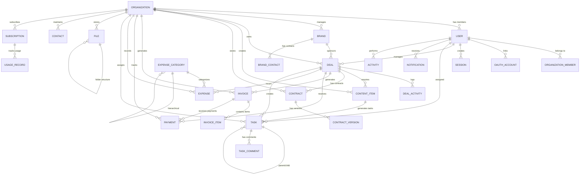

# CreatorOS - ER Diagram

## Entity Relationship Diagram

## Detailed Relationships

### Core Entities

#### Organization (Tenant)
- **Primary Key**: id (UUID)
- **Relationships**:
  - One-to-Many: Users (through organization_members)
  - One-to-Many: Brands
  - One-to-Many: Deals
  - One-to-Many: Content Items
  - One-to-Many: Contracts
  - One-to-Many: Invoices
  - One-to-Many: Payments
  - One-to-Many: Expenses
  - One-to-Many: Tasks
  - One-to-Many: Files
  - One-to-Many: Contacts
  - One-to-Many: Subscriptions
  - One-to-Many: Usage Records
  - One-to-Many: Audit Logs
  - One-to-Many: Activities

#### User
- **Primary Key**: id (UUID)
- **Relationships**:
  - Many-to-Many: Organizations (through organization_members)
  - One-to-Many: OAuth Accounts
  - One-to-Many: Sessions
  - One-to-Many: Deals (as assignee/manager)
  - One-to-Many: Tasks (as assignee/creator)
  - One-to-Many: Notifications
  - One-to-Many: AI History
  - One-to-Many: Activities

### CRM Entities

#### Brand
- **Primary Key**: id (UUID)
- **Foreign Keys**: organization_id
- **Relationships**:
  - Belongs to: Organization
  - One-to-Many: Deals
  - One-to-Many: Brand Contacts

#### Deal
- **Primary Key**: id (UUID)
- **Foreign Keys**: organization_id, brand_id, assigned_to, manager_id
- **Relationships**:
  - Belongs to: Organization
  - Belongs to: Brand (optional)
  - Assigned to: User
  - Managed by: User
  - One-to-Many: Deal Activities
  - One-to-Many: Content Items
  - One-to-Many: Contracts
  - One-to-Many: Invoices
  - One-to-Many: Payments
  - One-to-Many: Expenses
  - One-to-Many: Tasks

### Content Management

#### Content Item
- **Primary Key**: id (UUID)
- **Foreign Keys**: organization_id, deal_id
- **Relationships**:
  - Belongs to: Organization
  - Belongs to: Deal (optional)
  - One-to-Many: Tasks

#### Contract
- **Primary Key**: id (UUID)
- **Foreign Keys**: organization_id, deal_id
- **Relationships**:
  - Belongs to: Organization
  - Belongs to: Deal (optional)
  - One-to-Many: Contract Versions

### Financial Entities

#### Invoice
- **Primary Key**: id (UUID)
- **Foreign Keys**: organization_id, deal_id
- **Relationships**:
  - Belongs to: Organization
  - Belongs to: Deal (optional)
  - One-to-Many: Invoice Items
  - One-to-Many: Payments

#### Payment
- **Primary Key**: id (UUID)
- **Foreign Keys**: organization_id, invoice_id, deal_id
- **Relationships**:
  - Belongs to: Organization
  - Belongs to: Invoice (optional)
  - Belongs to: Deal (optional)

#### Expense
- **Primary Key**: id (UUID)
- **Foreign Keys**: organization_id, category_id, deal_id
- **Relationships**:
  - Belongs to: Organization
  - Belongs to: Expense Category
  - Belongs to: Deal (optional)

### Task Management

#### Task
- **Primary Key**: id (UUID)
- **Foreign Keys**: organization_id, deal_id, content_id, parent_task_id, assigned_to
- **Relationships**:
  - Belongs to: Organization
  - Belongs to: Deal (optional)
  - Belongs to: Content Item (optional)
  - Self-referential: Parent Task (hierarchical)
  - Assigned to: User
  - One-to-Many: Task Comments

### File Management

#### File
- **Primary Key**: id (UUID)
- **Foreign Keys**: organization_id, folder_id
- **Relationships**:
  - Belongs to: Organization
  - Self-referential: Folder (hierarchical structure)

### Subscription & Billing

#### Subscription
- **Primary Key**: id (UUID)
- **Foreign Keys**: organization_id
- **Relationships**:
  - Belongs to: Organization
  - One-to-Many: Usage Records

#### Usage Record
- **Primary Key**: id (UUID)
- **Foreign Keys**: organization_id
- **Relationships**:
  - Belongs to: Organization
  - Unique constraint: (organization_id, record_date)

### Additional Entities

#### Notification
- **Primary Key**: id (UUID)
- **Foreign Keys**: organization_id, user_id
- **Relationships**:
  - Belongs to: Organization
  - Belongs to: User

#### Activity
- **Primary Key**: id (UUID)
- **Foreign Keys**: organization_id, user_id
- **Relationships**:
  - Belongs to: Organization
  - Belongs to: User

#### Audit Log
- **Primary Key**: id (UUID)
- **Foreign Keys**: organization_id, user_id
- **Relationships**:
  - Belongs to: Organization
  - Belongs to: User (optional)

## Cardinality Summary

| Relationship | Type | Description |
|-------------|------|-------------|
| Organization → User | 1:N | One organization has many member users |
| User → Organization | N:M | Users can belong to multiple organizations |
| Organization → Brand | 1:N | One organization manages many brands |
| Brand → Deal | 1:N | One brand can have many deals |
| Deal → Content Item | 1:N | One deal requires many content pieces |
| Deal → Invoice | 1:N | One deal can generate multiple invoices |
| Invoice → Payment | 1:N | One invoice can have multiple payments |
| Task → Task | 1:N | Hierarchical parent-child relationship |
| File → File | 1:N | Folder structure hierarchy |
| Contract → ContractVersion | 1:N | One contract has many versions |
| ExpenseCategory → ExpenseCategory | 1:N | Hierarchical categories |

## Indexes Strategy

### Primary Indexes
- All primary keys (UUID) are automatically indexed

### Foreign Key Indexes
- organization_id on all tenant-scoped tables
- deal_id on related entities
- user_id on assignment tables

### Query Optimization Indexes
- `deals(stage, status)` - Pipeline queries
- `deals(due_date)` - Deadline tracking
- `invoices(status, due_date)` - Payment tracking
- `tasks(status, assigned_to, due_date)` - Task management
- `content_items(scheduled_date, platform)` - Calendar views
- `notifications(user_id, is_read, created_at)` - Notification feed
- `payments(payment_date)` - Revenue tracking
- `analytics_snapshots(organization_id, snapshot_date)` - Historical data

### Full-Text Search
- `brands(name, company_name)` - Brand search
- `deals(campaign_name, description)` - Deal search
- `contacts(name, company)` - Contact search

## Data Integrity

### Constraints
- All foreign keys use CASCADE or SET NULL on delete
- Unique constraints on natural keys (email, slug, invoice_number)
- Check constraints on enum values
- Generated columns for computed fields (amount_due, full_name)

### Soft Delete Pattern
- Users and critical entities use `deleted_at` timestamp
- Queries filter out deleted records by default
- Hard delete after retention period

### Multi-Tenancy Isolation
- Every query includes organization_id filter
- Row-level security policies in production
- Organization context validated on every request
